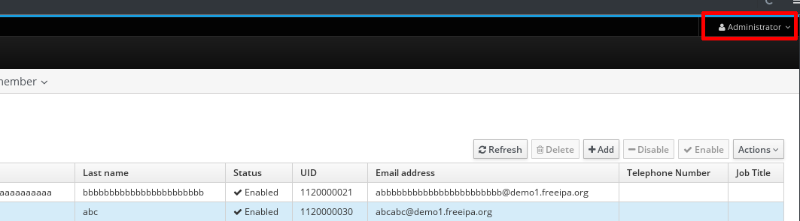

# Test plan for FreeIPA login page

According to IEEE 829-1998 and IEEE 29119-3 formats.

Using template available
[here](http://www.fit.vutbr.cz/study/courses/ITS/public/testplan.md).

## Test Plan Identifier

FreeIPA web interface - login page

Author: Tomas Coufal <xcoufa09@stud.fit.vutbr.cz>

Version: 1.0, 04/11/2016

## Introduction

Specify a test plan for default FreeIPA web login page. Identify issues to test
covering a basic login functionality, advanced optional login scenarios. In
addition focus related after-steps such as role identification on freeIPA
default dashboard.

Verify user can correctly log in with his own valid credentials and his login is
secured. Wrong credentials should result in failed attempt to log in. Ensure
the login page navigates user correctly for Kerberos configuration and is able
to log user in via Kerberos ticket.

## References

FreeIPA sites and reference manuals:
  * [Documentation](http://www.freeipa.org/page/Documentation)
  * [Currently available test plans](http://www.freeipa.org/page/V4_Test_Plans)
  * [Web UI documentation - login section](http://www.freeipa.org/page/Web_UI#Login)
  * [Kerberos for FreeIPA detailed documentation](http://www.freeipa.org/page/Kerberos)
  * [Trac](https://fedorahosted.org/freeipa/) including current Roadmap and bug tracker/ticketing system

Other references and test plan specification:
  * FIT VUT - ITS subject - [freeIPA project specifications](https://wis.fit.vutbr.cz/FIT/st/cwk.php?title=ITS:Projekt1&csid=606594&id=10349#Up%C5%99esn%C4%9Bn%C3%AD_variant_freeIPA)

## Test Items

  * FreeIPA, version: 4.3.1
  * Login page of the web interface component
  * Demo instance is available [here](https://ipa.demo1.freeipa.org/)

## Features to be Tested

  * Basic login functionality
    - Credentials used are username and password
    - Dashboard coresponds with user role
    - User is noted as a logen user
  * Advanced login options
    - Kerberos login
  * Kerberos configuration guide

## Features Not to Be Tested

  * Login using OTP token along with password andOTP Token synchronization
    - Neither OTP token available for automated testing nor user account with token associated

## Approach

Reactive testing based on a stable product. It's crucial to test both, the
positive and negative scenarios. The product is treated as a black box and the
test suite can be considered as component interface testing and security testing
at the same time.

## Item Pass/Fail Criteria

All security related test cases has to be completed and passed to consider test
as passed. By security related test cases are considered these ones covering the
login logic.

When testing the Kerberos setup guide failure of these tests should not cause a
whole test run to fail because it's not a crucial part of the product.

## Test Deliverables

Test plan and test suite including test cases listed below.

### Test cases

Basic login:
  * Use a valid username and its valid password
    - Check if the user is logged in correctly and dashboard is displayed
    - Do so for each available user role
    - Check if user is noted as logged user on the dashboard

    - Dashboard:
    

  * Try to log in with invalid credentials
    - Try modified username and password (prepend or append letters, substitute uppercase letters with lowercase and vice versa)
    - Try extremely long data and invalid letters
    - Test should end with unsuccessful login and FreeIPA should display the login page again with an alert

    - Login failed:
    

Kerberos login:
  * Use valid active ticket for login
    - Login should proceed to dashboard
  * Try to log in via Kerberos without a valid ticket
    - As a result test should be redirected by server to web login page

Kerberos setup guide:
  * Lookup the guide, check if all pages are accessible

    - Kerberos guide - step 1:
    

    - Kerberos guide - step 2:
    

    - Kerberos guide - step 3:
    

    - Kerberos guide - step 4:
    

  * Try get a link for FreeIPA certificate for Kerberos and download it
  * Discover each certificate linkif it points to the same  location

    - Main certificate link location:
    

    - Additional links:
    

## Test Environment

To maintain compatibility with other FreeIPA testing suites implement the test
cases using [Pytest](http://pytest.org) and
[Selenium](http://www.seleniumhq.org/). Let the tests assume there is a FreeIPA
instance already available.

## Schedule

Test plan schedule:
  * 03/29/2016 Task created
  * 04/11/2016 Test plan submission

Test suite implementation:
  * 04/11/2016 Test implementation starts
  * 05/01/2016 Deadline for test suite

## Assumptions and Dependencies

The tests assumes there is a FreeIPA instance already available.
